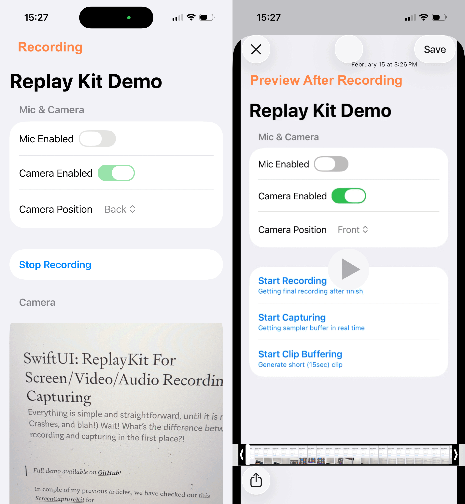

# SwiftUI_ReplayKitDemo
A demo of using ReplayKit for

1. Recording
2. Capturing
3. Genrating Clip

With or without mic/camera capture. 

For more details, please check out my blog [SwiftUI: ReplayKit For Screen/Video/Audio Recording or Capturing](https://medium.com/@itsuki.enjoy/swiftui-replaykit-for-screen-video-audio-recording-or-capturing-5db461bde024)

